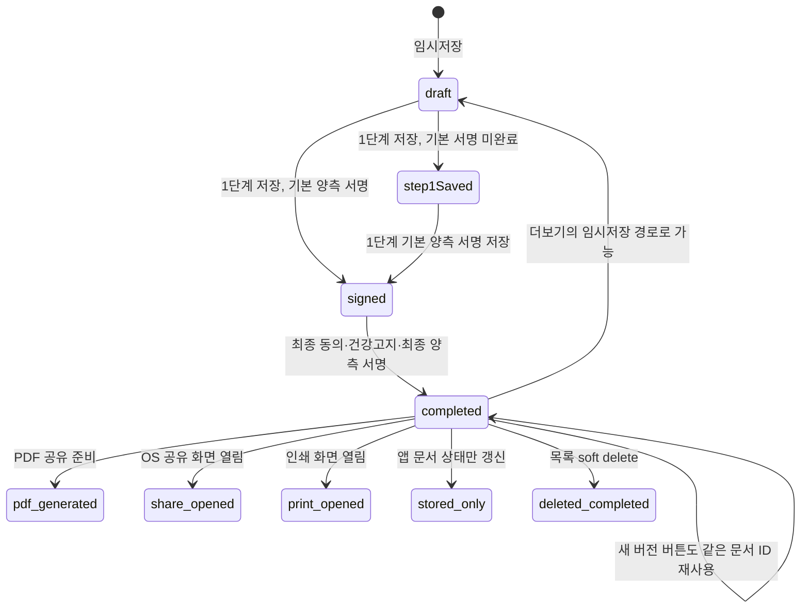
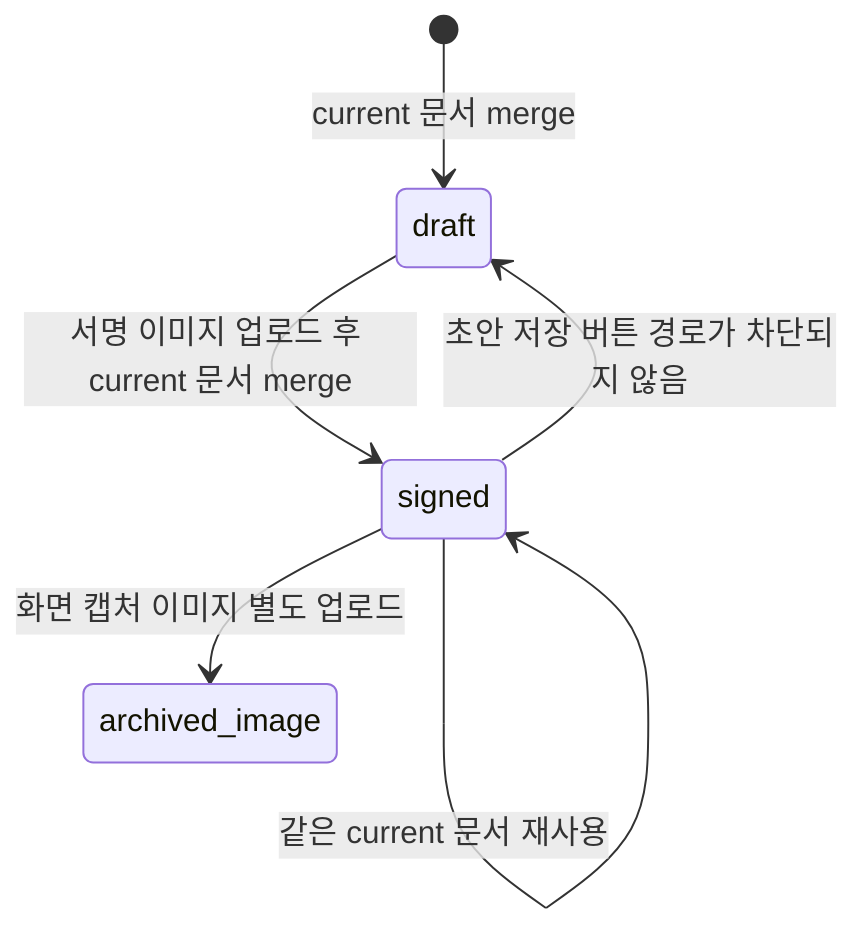
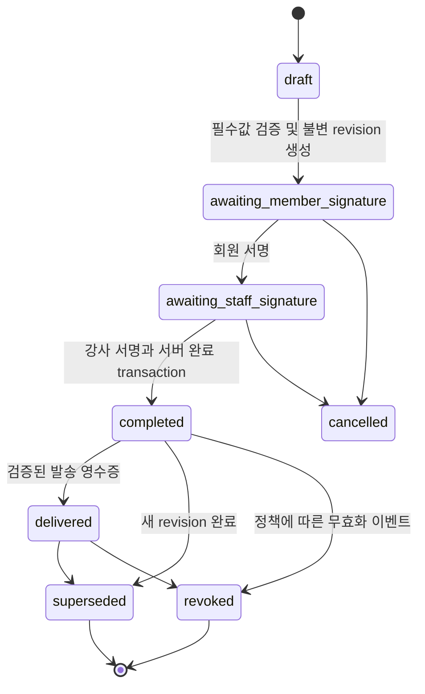
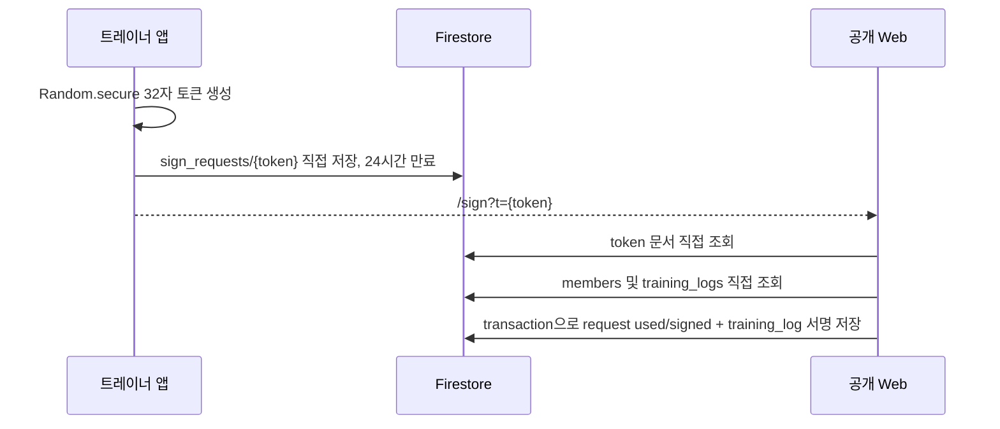
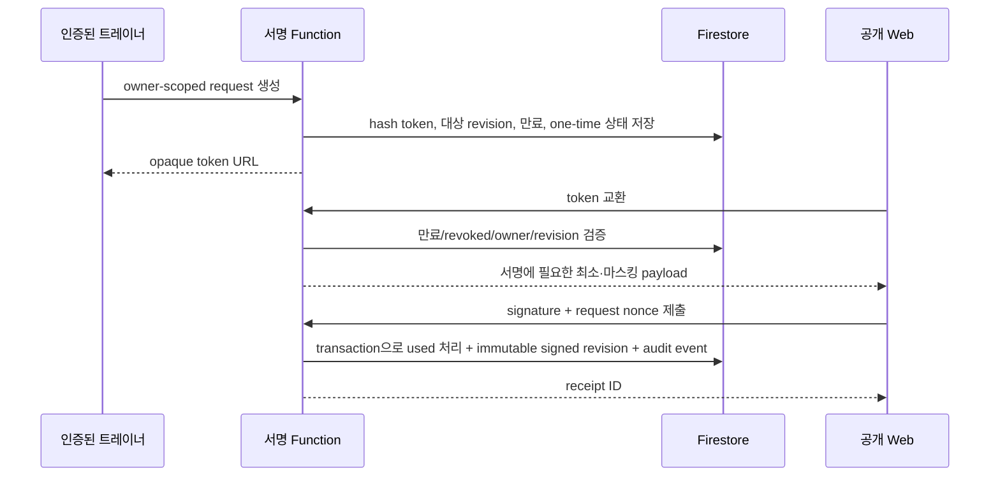

# 계약서·전자서명 읽기 전용 감사

감사일: 2026-07-15

범위: 현재 저장소의 계약서, 회원권계약서, 레슨확정 서명, 원격 서명, PDF/이미지 공유 흐름과 anatomy 실데이터 연결

제한: 실제 Firebase 프로젝트, 배포 Rules, 에뮬레이터, 실제 전송 사업자 영수증은 확인하지 않았다. 법적 효력은 평가하지 않고 기술적 무결성과 증빙 가능성만 평가한다.

## 요약

- 레슨계약서는 `draft → step1Saved/signed → completed` 흐름을 사용하지만, 1단계 기본 서명만으로 `signed` 및 회원 문서의 `contractSigned=true`가 된다. 최종 동의·건강고지·최종 서명 이전에도 완료 계약처럼 소비될 수 있는 P0 상태 의미 오류다.
- 완료 계약의 불변 본문 스냅샷, 본문/PDF 해시, 서버가 검증한 서명자 UID, 영속적인 버전 문서가 없다. UI 잠금은 있으나 서버 무결성 경계가 아니다.
- 회원권계약서는 `members/{memberId}/membership_contracts/current` 한 문서를 계속 병합한다. 서명 후 초안 저장도 코드상 가능하고, 새 버전/이전 버전 이력이 없다.
- 공개 원격 서명은 32자 난수 토큰을 URL query로 전달하고 클라이언트가 Firestore를 직접 읽고 transaction으로 요청과 레슨일지를 갱신한다. 서버 Function 검증, 취소 사유/시도 로그/rate limit가 없다. 저장소 Rules는 이 경로를 허용하지 않아 현재 코드와 Rules가 양립하지 않는다.
- `Printing.sharePdf`는 OS 공유 화면을 여는 기능이다. 코드에는 SMS/카카오/이메일 발송 성공 영수증이나 `delivered/viewed` 증거가 없다.
- anatomy는 `training_logs/{lessonLogId}/anatomyRecords/{anatomyLogId}`에 저장하지만, 서비스가 상위 레슨일지 존재·소유자·회원 일치를 강제하지 않고 없는 부모를 암묵적으로 생성한다. 현재 Rules에서는 전부 거부되며, 기존 문서의 Rules 예시도 부모-자식 정합성을 충분히 보장하지 않는다.

## 1. 현재 상태 머신

### 1.1 레슨계약서

코드 상태값은 `draft`, `step1Saved`, `awaitingSign`, `signed`, `sent`, `cancelled`, `superseded`다. 저장 코드에서는 추가로 문자열 `completed`, `pdf_generated`, `share_opened`, `print_opened`, `stored_only`를 사용한다. `awaitingSign`, `sent`, `cancelled`, `superseded`의 완결된 전이 구현은 확인하지 못했다.



중요한 불일치:

- `_saveStep1Contract`는 기본 회원/강사 서명만 있으면 계약 상태를 `signed`로 만들고 회원 문서의 `contractSigned=true`를 같은 transaction에서 기록한다.
- `_saveStep2Contract`가 최종 완료 문서에는 `status: completed`를 저장하지만 메모리의 enum은 `signed`로 둔다. 목록은 두 값을 모두 완료로 취급한다.
- `_isFormLocked`는 최종 양측 서명 포인트 유무에 의존한다. 서버가 완료 상태와 불변성을 강제하지 않는다.
- `_startNewVersion`은 로컬 `_version`만 증가시키고 같은 `_contractId`를 유지한다. 이전 버전을 `superseded`로 보존하지 않는다.
- `_handleTempSave`는 완료 계약에서도 호출될 수 있고 같은 문서에 `status: draft`를 병합할 수 있다.
- 목록 삭제는 `isDeleted=true` soft delete일 뿐 회원 문서의 `contractId/contractSigned`와 동기화하지 않는다.

### 1.2 회원권계약서



- 상태는 사실상 `draft/signed`뿐이다.
- 문서 ID가 항상 `current`라 계약 갱신, 재등록, 재서명이 과거 계약을 덮을 수 있다.
- `_saveDraft`는 `_isSigned`를 검사하지 않는다. 서명 완료 문서에 `status: draft`를 병합하면서 기존 `signedAt/signatureImageUrl`은 남겨 혼합 상태가 될 수 있다.
- 취소, 무효, 철회, superseded, 버전 연결, 감사 로그는 확인되지 않았다.

### 1.3 권장 상태 머신



권장 원칙은 상태 전이 이벤트와 불변 revision을 분리하고, `completed` 이후 원문 수정 대신 새 revision만 허용하는 것이다. `share_opened`는 계약 상태가 아니라 delivery event여야 한다.

## 2. 쓰기 경로 감사

| 사용자 액션 | 메서드 | Firestore | Storage | 원자성 | 중복 방지 | 실패/롤백 | UI 성공 조건 |
|---|---|---|---|---|---|---|---|
| 1단계 저장/다음 | `ContractPage._saveStep1Contract` | `contracts/{id}`, `members/{memberId}`, 필요 시 `contractCounters/{yyyy-MM}` | 없음 | 계약+회원은 transaction, 번호 발급은 별도 transaction | 저장 flag를 검사하지만 시작 시 true로 만들지 않아 실효 없음 | 계약+회원은 함께 실패. 번호는 먼저 소비 가능 | transaction 성공 후 성공 표시 |
| 최종 계약 완료 | `_saveStep2Contract` | `contracts/{id}` | 없음 | 단일 write. 회원 자동등록은 이후 별도 비동기 흐름 | `_isSavingContract` 있음 | 계약 완료 후 회원 자동등록 실패 가능 | 계약 write 성공 직후 완료 표시 |
| 임시저장 | `_handleTempSave` | `contracts/{id}` | 없음 | 단일 write | busy flag 있음 | 롤백 없음 | write 성공 |
| 완료 계약 soft delete | `ContractListPage` 삭제 처리 | `contracts/{id}` | 없음 | 단일 merge | 확인창만 있음 | 회원 계약 포인터 동기화 없음 | write 성공 |
| 회원카드 자동등록 | `_registerClientCardFromContract` | `members/{id}`, `contracts/{id}` | 없음 | transaction | 계약 autoRegister 상태 확인은 있으나 동시 UI 흐름 검증은 제한적 | transaction 단위 실패 | transaction 성공 |
| PDF 저장 메뉴 | `_trySavePdf` | `contracts/{id}.delivery` | 실제 파일 저장 없음 | 비원자 | 없음 | 로컬 `_pdfSaved`가 상태 write/공유보다 먼저 true가 될 수 있음 | 공유 화면 호출 성공 여부와 별개 상태 혼재 |
| 고객 전송/인쇄 | `_trySendCustomer` | `contracts/{id}.delivery` | 없음 | 비원자 | 재전송 event ID 없음 | OS 공유창 이후 실제 전송 실패 추적 불가 | `share_opened`/`print_opened`만 기록 |
| 회원권 초안 | `MembershipContractPage._saveDraft` | `members/{id}/membership_contracts/current`, `members/{id}` | 없음 | 두 개의 순차 write | `_isSaving` 있음 | 첫 write만 성공할 수 있음 | 두 write 성공 후 토스트 |
| 회원권 서명 완료 | `_completeSignature` | 위 `current`, `members/{id}` | `membership_contract_signatures/{memberId}/signature_{ms}.png` | 업로드+두 write가 모두 분리 | `_isSigning`은 있으나 파일명은 시간 기반 | 고아 이미지 또는 계약/회원 반쪽 상태, 롤백 없음 | 모든 단계 성공 후 토스트 |
| 회원권 이미지 보관 | `_archiveContractImage` | 위 `current`, `members/{id}` | `membership_contract_images/{memberId}/contract_{ms}.png` | 모두 분리 | `_isArchivingImage`만 있음 | 고아 파일/부분 성공, 롤백 없음 | 모든 단계 성공 후 토스트 |
| 원격 서명 요청 생성 | Home/quick sign/log page의 request 생성 | `sign_requests/{token}` | 없음 | 단일 write | Home만 기존 대기 요청 재사용, 다른 두 경로는 매번 새 토큰 | 롤백 없음 | write 성공 후 QR/공유 시트 |
| 원격 회원 서명 | `MemberSignatureWebPage._submitSignature` | `sign_requests/{token}`, `training_logs/{id}` | 없음 | 한 transaction | transaction에서 `used/signed` 재검사 | 두 문서는 함께 실패 | transaction 성공 후 완료 UI |
| 레슨확정/차감 | `LessonConfirmationService.confirmFromHome`, quick sign save | member/log/schedule/ledger | 없음 | transaction | log/차감 키 검사 | transaction 실패 | transaction 성공 |
| 확정 취소/복구 | `LessonConfirmCancelService.cancelByScheduleDocId`, log page 취소 | member/log/schedule/reverse ledger | 없음 | transaction | reverse ledger ID 안정적이나 상태 기반 재호출 검증 필요 | transaction 실패 | transaction 성공 |

## 3. 주요 발견

### P0-01 1단계 서명이 전체 계약 완료로 승격됨

- 파일/메서드: `lib/pages/contract_page.dart`, `_saveStep1Contract`, `_step1ContractPayload`
- 현재 동작: 기본 정보 확인용 양측 서명만 있으면 `status=signed`, 회원 `contractSigned=true` 및 `contractSignedAt`을 저장한다.
- 재현: 1단계 정보와 기본 양측 서명을 입력해 저장하고 최종 동의·건강고지·최종 서명은 하지 않는다.
- 영향: 빠른서명/레슨확정은 `contractSigned==true`를 계약 연결 근거로 사용하므로 미완료 계약이 완료 계약처럼 회차 정책에 들어갈 수 있다.
- 최소 수정 방향: 1단계 상태를 `step1_signed` 또는 `awaiting_final_signature`로 분리하고 회원 `contractSigned`는 서버에서 최종 revision 완료 시에만 변경한다.
- 테스트: 1단계 저장 뒤 member와 레슨확정 basis가 미완료로 남는 통합 테스트.
- 확신 수준: 확인.

### P0-02 필수값 오류가 1단계 저장을 차단하지 않음

- 파일/메서드: `lib/pages/contract_page.dart`, `_saveStep1Contract`
- 현재 동작: `errors` 목록에 필수값/결제/기간 오류를 추가하지만 `errors.isNotEmpty` 검사 없이 중복 전화 확인과 저장으로 진행한다.
- 재현: 필수값을 비우고 1단계 저장을 실행한다.
- 영향: 불완전 계약과 회원 요약이 영속화될 수 있다.
- 최소 수정 방향: 저장 전에 validator 결과를 단일 gate로 강제하고 실패 시 어떤 write/번호 발급도 실행하지 않는다.
- 테스트: 각 필수값 누락 및 복합 누락에서 write 0회.
- 확신 수준: 확인.

### P0-03 완료 계약의 불변 revision과 서버 무결성 검증 부재

- 파일/메서드: `contract_page.dart`의 저장, 임시저장, `_startNewVersion`, 서명 초기화 메서드
- 현재 동작: 같은 계약 문서를 merge로 계속 수정한다. 서명 제거는 로컬 UI 상태이고 content/PDF hash가 없다. 새 버전도 같은 문서 ID다.
- 재현: 완료 계약을 불러와 새 버전 또는 임시저장 경로를 사용하거나 직접 허용된 client write를 수행한다.
- 영향: 어떤 본문에 누가 서명했는지 사후 증명이 약하고 이전 버전 복원이 불가능하다.
- 최소 수정 방향: 서버가 불변 `contract_versions/{versionId}`를 생성하고 hash, signer UID/role, server time, 이전 버전 연결을 검증한다. 완료 revision update 금지.
- 테스트: 완료 revision 필드 수정 거부, 새 revision 생성 및 이전 revision 보존.
- 확신 수준: 확인.

### P0-04 회원권계약서가 서명 후 초안으로 되돌아갈 수 있음

- 파일/메서드: `lib/pages/membership_contract_page.dart`, `_saveDraft`, `_completeSignature`
- 현재 동작: 항상 `membership_contracts/current`에 merge하고 초안 저장은 signed 상태를 막지 않는다. 남은 서명 필드와 `status=draft`가 공존할 수 있다.
- 재현: 서명된 current 문서를 연 상태에서 초안 저장 경로 실행.
- 영향: 계약 상태가 모순되고 이전 계약 이력이 소실된다.
- 최소 수정 방향: 안정적인 version ID 문서를 만들고 signed revision은 불변으로 유지한다. 초안은 별도 draft ID 또는 새 revision으로 만든다.
- 테스트: signed → draft 금지, 새 버전 생성, 이전 버전 조회.
- 확신 수준: 확인.

### P0-05 원격 서명과 저장소 Rules가 호환되지 않음

- 파일/메서드: `member_signature_web_page.dart`, request 생성 3개 경로, `firestore.rules`, `functions/src/index.ts`
- 현재 동작: 공개 웹 클라이언트가 `sign_requests`, `training_logs`, `members`, `re_registration_requests`를 직접 읽고 쓴다. 현재 Rules에는 이 경로 match가 없고 서명 Function도 없다.
- 재현: 저장소 Rules를 배포 기준으로 가정하고 비로그인 `/sign?t=...` 접근.
- 영향: default deny라면 기능 전체가 실패한다. 운영에서 동작한다면 배포 Rules가 저장소와 달라 변경 추적 및 보안 검토가 불가능하다.
- 최소 수정 방향: 배포 Rules를 먼저 대조하고, 공개 토큰 교환/제출을 callable 또는 HTTPS Function으로 이동한다. 앱이 일반 회원/로그 문서를 직접 읽지 않게 한다.
- 테스트: 비로그인 최소 payload 교환, 위조 ID 차단, Rules emulator.
- 확신 수준: 저장소 불일치는 확인, 실제 배포 상태는 확인 불가.

### P0-06 멀티테넌시 소유권 경계가 데이터에 없음

- 파일/메서드: 계약 payload, 계약 목록 query, `firestore.rules`
- 현재 동작: 계약에 `trainerId/ownerId`가 없고 목록은 전체 `contracts` 상위 50개를 조회한다. members read rule도 모든 로그인 사용자에게 전체 경로를 허용한다.
- 재현: 둘 이상의 트레이너 데이터가 같은 프로젝트에 존재하고 쿼리가 허용되는 Rules 환경.
- 영향: 다른 트레이너의 회원·계약 노출 가능성. 현재 계약 query는 local Rules에서는 아예 거부된다.
- 최소 수정 방향: tenant/owner 필드를 모든 보호 문서에 의무화하고 query와 Rules를 같은 조건으로 제한한다.
- 테스트: 트레이너 A/B 교차 읽기·쓰기 거부.
- 확신 수준: 코드/Rules 결함은 확인, 실제 운영 노출은 배포 Rules 확인 필요.

### P1-01 계약번호 및 저장 재진입 경쟁

- 파일/메서드: `_saveStep1Contract`, `_generateContractNo`
- 현재 동작: `_isSavingContract`를 검사하지만 1단계 저장 시작에서 true로 설정하지 않는다. ID/번호 확정 전 await가 있다.
- 영향: 빠른 연속 탭으로 복수 번호 소비 또는 서로 다른 로컬 ID 경합 가능성이 있다.
- 최소 수정 방향: 첫 동기 구간에서 busy 설정, 안정적 mutation ID와 서버 idempotency 적용.
- 테스트: 2회 동시 호출에서 계약 write 1회, 번호 증가 1회.
- 확신 수준: 경쟁 가능성은 강한 추정.

### P1-02 회원권 서명 이미지와 문서가 부분 성공 가능

- 파일/메서드: `_completeSignature`, `_archiveContractImage`
- 현재 동작: Storage 업로드, contract write, member write가 순차 실행되고 보상 삭제가 없다.
- 영향: 고아 이미지, signed 계약과 unsigned member summary 또는 반대 상태가 남는다.
- 최소 수정 방향: 서버 조정 작업, 업로드 staging/finalize, Firestore batch/transaction, 실패 정리 작업.
- 테스트: 각 단계 fault injection과 재시도 idempotency.
- 확신 수준: 확인.

### P1-03 로컬 시간과 서명자 식별 정보가 증빙에 부족

- 파일/메서드: 모든 서명 payload
- 현재 동작: 여러 `signedAt`이 `DateTime.now()`를 Timestamp로 바꾼 client time이다. 계약에는 signer UID, owner ID, 서명한 revision ID가 없다.
- 영향: 시간 조작과 서명-본문 연결 검증이 어렵다.
- 최소 수정 방향: 서버 완료 시각, auth UID/검증된 member identity, signature method, version ID를 서버가 기록한다.
- 테스트: client supplied identity/time 무시.
- 확신 수준: 확인.

### P1-04 전송 상태가 증거 수준별로 분리되지 않음

- 파일/메서드: `_trySavePdf`, `_trySendCustomer`, `_updateContractDeliveryStatus`
- 현재 동작: OS 공유/인쇄 화면 열림은 기록하지만 실제 SMS/카카오/이메일 전송 영수증은 없다. 재전송 event 목록과 수신 대상 마스킹도 없다.
- 영향: UI/데이터가 실제 전달 성공으로 오해될 수 있다.
- 최소 수정 방향: `requested/share_opened/provider_accepted/delivered/viewed/failed` event를 분리하고 증거가 없으면 “공유 화면 열림”만 표시한다.
- 테스트: 공유 취소, provider 실패, 재전송 이력.
- 확신 수준: 확인.

### P1-05 완료 계약 soft delete와 회원 포인터 불일치

- 파일/메서드: `contract_list_page.dart` 삭제 처리
- 현재 동작: 계약만 숨김 처리하며 회원의 `contractId`, `contractSigned`, `lastContractSummary`를 갱신하지 않는다.
- 영향: 목록에는 없지만 회원카드는 계약 완료/연결 상태로 남는다.
- 최소 수정 방향: 삭제 대신 명시적 revoked/superseded 정책과 원자적 current pointer 갱신.
- 테스트: 완료 계약 무효화 뒤 회원 current contract 선택.
- 확신 수준: 확인.

### P1-06 계약 자동등록이 기존 회차를 초기값으로 덮을 수 있음

- 파일/메서드: `_buildClientCardAutoRegisterPayload`, `_registerClientCardFromContract`
- 현재 동작: 기존 회원과 merge할 때 총/잔여를 새 계약 총회차로, 완료/노쇼/서비스 집계를 0으로 구성한다.
- 영향: 재등록 시 진행 중 회차 및 누적 집계가 유실될 수 있다.
- 최소 수정 방향: 기존 ledger를 기준으로 재등록 credit event를 추가하고 파생 집계를 계산한다.
- 테스트: 기존 잔여/사용 이력이 있는 재등록.
- 확신 수준: 확인.

### P2-01 대형 화면 파일과 상태 문자열 분산

- 파일: `contract_page.dart`, `home_page.dart`, `personal_training_log_page.dart`
- 현재 동작: 상태 해석, Firestore payload, UI, 전송이 대형 StatefulWidget 안에 섞여 있고 동일 개념에 enum/string/중복 필드가 공존한다.
- 영향: 회귀와 상태 누락 위험이 높다.
- 최소 수정 방향: P0/P1 안정화 후 상태 전이/저장 service와 typed model을 작은 단위로 추출한다.
- 테스트: model/state transition 단위 테스트.
- 확신 수준: 확인.

### P0-07 anatomy 부모-자식 소유권과 식별자 정합성을 검증하지 않음

- 파일/메서드: `lib/services/anatomy_log_service.dart`, `AnatomyLogService.load/save`
- 현재 동작: 저장 전에 `training_logs/{lessonLogId}`를 읽지만, 부모의 `trainerId/memberId/scheduleDocId`가 요청과 같은지 검사하지 않는다. 부모가 없으면 anatomy 저장 메서드가 새 `training_logs` 문서를 함께 만든다. 기존 부모의 `trainerId`가 비어 있으면 현재 클라이언트 UID로 채운다.
- 재현: 존재하지 않는 lessonLogId로 save를 호출하거나, 다른 trainer/member가 적힌 기존 부모 ID와 현재 사용자의 record를 전달한다.
- 영향: Rules가 단순 `isStaff()`로 열리면 임의 부모 생성, owner 없는 과거 로그 선점, 다른 회원/트레이너 부모 아래 하위 기록 혼입이 가능하다. 현재 저장소 Rules에서는 경로 전체가 거부되므로 실제 악용 가능성은 배포 Rules 확인이 필요하다.
- 최소 수정 방향: anatomy child save는 부모 존재를 필수로 하고 부모 생성은 검증된 일반 레슨일지 생성 서비스로 분리한다. 부모의 신뢰 가능한 `trainerId/memberId`와 요청·자식 필드를 transaction 및 Rules에서 모두 비교한다. owner 없는 과거 부모는 client가 선점하지 못하게 승인된 backfill을 거친다.
- 테스트: 부모 없음, 부모 trainer/member 불일치, owner 없는 과거 부모, 임의 lessonLogId에 대한 service 및 Rules emulator 거부 테스트.
- 확신 수준: 코드 동작은 확인, 실제 배포 노출은 추가 검증 필요.

### P0-08 anatomy 경로 ID와 문서 식별 필드가 불변이 아님

- 파일/메서드: `anatomy_log_service.dart`의 `save`, `models/anatomy_log.dart`의 `copyWith/toFirestore`, `anatomy_page.dart`의 `_save`
- 현재 동작: 문서 경로의 ID는 전달된 `anatomyLogId`를 사용하지만 record의 `lessonLogId`, `trainerId`, `memberId`, `scheduleDocId`를 매번 merge한다. 서비스는 `record.lessonLogId == path lessonLogId`나 record identity가 save context와 같은지 검사하지 않는다. UI는 불러온 record를 현재 화면 ID로 덮어써 불일치를 거부하지 않고 교정한다.
- 재현: path lessonLogId와 다른 record.lessonLogId, 다른 memberId/trainerId를 가진 record를 service에 전달하거나 기존 record update에서 identity를 변경한다.
- 영향: 문서 경로와 필드가 모순되거나 record의 소유 회원·트레이너가 변경될 수 있고, 감사 추적에서 원래 귀속을 잃는다.
- 최소 수정 방향: create에서 path와 모든 identity를 검증하고 update에서는 `anatomyLogId/lessonLogId/trainerId/memberId`를 불변으로 강제한다. `scheduleDocId`는 부모에서 파생하고 변경이 필요하면 별도 연결 변경 작업으로 감사한다. 불일치는 자동 덮어쓰기보다 오류로 중단한다.
- 테스트: path/field 불일치, doc ID/anatomyLogId 불일치, update identity 변경, 삭제 대상 소유권 테스트.
- 확신 수준: 확인.

### P1-07 `scheduleDocId` 필수 조건이 정상 레슨일지 진입과 맞지 않음

- 파일/메서드: `AnatomyLogSaveContext`, `PersonalTrainingLogPage._openNewLogSheet/_openAnatomyLogPage`, quick sign 및 remote sign 생성 경로
- 현재 동작: anatomy 진입과 저장은 scheduleDocId를 필수로 본다. 그러나 수동 레슨일지 draft는 scheduleDocId가 없고 Firestore 부모도 아직 없으며, 홈에서 일정으로 레슨일지 화면을 열어도 schedule ID를 페이지에 전달하지 않는다. 빠른서명 생성자와 저장 payload도 scheduleDocId를 선택 사항으로 취급하고, 레슨일지 페이지에서 만든 원격서명 로그에도 scheduleDocId가 없다. 과거 training log 역시 해당 필드가 없을 수 있다.
- 재현: 회원카드/회원목록/홈의 레슨일지 화면에서 수동 draft에 anatomy를 선택하거나 schedule 없는 quick/remote/과거 log에서 anatomy를 연다.
- 영향: 유효한 lessonLogId/memberId가 있어도 anatomy 작성이 차단된다. 반대로 schedule ID가 있다고 부모 소유권이 증명되는 것도 아니다.
- 최소 수정 방향: 필수 키는 존재하는 부모 lessonLogId, authenticated trainer owner, memberId로 정한다. scheduleDocId는 선택 참조로 두고 값이 존재할 때만 부모 값과 일치시킨다. 수동 anatomy-first 작성은 먼저 정식 부모 레슨일지를 생성한 후 child를 저장한다.
- 테스트: schedule 없는 수동/quick/remote/과거 기록과 schedule 있는 일정 기록을 각각 검증한다.
- 확신 수준: 확인.

### P1-08 상위 로그 삭제 시 anatomy 하위 문서가 고아로 남을 정책 공백

- 파일/메서드: `AnatomyLogService`, training log 삭제/void 흐름
- 현재 동작: 회원 또는 상위 레슨일지 cascade delete를 구현하지 않았다. Firestore는 부모 문서 삭제가 하위 collection을 자동 삭제하지 않으므로 향후 부모 hard delete가 생기면 anatomyRecords가 남는다. 현재 확인된 확정 취소는 log를 `voided`로 표시하며 hard delete 경로는 찾지 못했다.
- 재현: 관리자/향후 코드가 `training_logs/{lessonLogId}`를 hard delete하고 하위 collection을 직접 조회한다.
- 영향: 건강·통증 메모가 고아 데이터로 보존되고, Rules가 부모 존재를 확인하지 않으면 계속 읽힐 수 있다.
- 최소 수정 방향: 임의 client cascade는 추가하지 않는다. 부모는 우선 soft delete/retention 상태로 두고 Rules가 부모 존재·owner·비삭제 상태를 확인하도록 한다. 보존기간 이후 서버 관리 recursive cleanup과 감사 로그를 별도 승인 작업으로 설계한다.
- 테스트: 부모 없음/soft deleted 상태의 child read-write 거부, 승인된 cleanup의 범위 및 다른 레슨 child 비영향 테스트.
- 확신 수준: Firestore 동작과 현재 정책 공백은 확인, 실제 hard delete 운영 여부는 확인 불가.

### P2-02 anatomy 목록 요약 개수가 새 저장 구조와 불일치

- 파일/메서드: `PersonalTrainingLogPage._loadAnatomyLogsFromFirestore`
- 현재 동작: 부모의 `hasAnatomyRecords=true`로 로그를 찾지만 표시 개수는 legacy 부모 배열 `anatomyRecords.length`에서 계산한다. 정상 저장은 그 배열을 삭제하고 하위 collection을 쓰므로 신규 구조는 `신체 부위 기록 0개`로 표시될 수 있다.
- 재현: 하위 collection에만 anatomy record가 있는 부모를 레슨일지 목록에서 불러온다.
- 영향: 저장된 기록 수가 0으로 잘못 표시되어 데이터 신뢰를 떨어뜨린다.
- 최소 수정 방향: 부모에 서버/transaction으로 관리하는 `anatomyRecordCount`를 두거나 상세 진입 시 하위 문서를 조회한다. client가 임의 count를 신뢰하지 않게 한다.
- 테스트: child 0/1/여러 개, 삭제 후 count, legacy 배열 fallback 표시 테스트.
- 확신 수준: 확인.

## 4. 서명 무결성 비교

| 항목 | 레슨계약서 | 회원권계약서 | 레슨확정/빠른서명 |
|---|---|---|---|
| 불변 본문 스냅샷 | 없음 | 없음 | 레슨 당시 일부 snapshot만 있음 |
| contentHash/pdfHash | 없음/없음 | 없음/해당 없음 | 없음 |
| schema/terms/contract version | 로컬 `_version`만, 미저장 | 없음 | 없음 |
| signer role/UID | member/staff 의미는 필드명에만, UID 없음 | 이름만 | `signedBy` 문자열, auth UID 없음 |
| 서버 권위 signedAt | flattened 일부 serverTimestamp, nested 포인트 시간은 client | client time | 대부분 client time, 일부 trainer confirm server time |
| 서명 방법 | 기본/final 구조, 대면 여부 불명 | `drawn_signature` | member_web/member_app/confirm_button 문자열 |
| 서명과 revision 연결 | 없음 | 없음 | trainingLogId에는 연결되나 immutable revision 없음 |
| 이전 버전 연결 | 없음 | 없음 | 해당 없음 |
| 취소/무효 이력 | soft delete/상태 문자열, 완결된 이벤트 없음 | 없음 | log void/reverse ledger는 존재 |

### 권장 완료 계약 최소 필드

```text
contractId, contractVersionId, schemaVersion, termsVersion,
contentHash, pdfHash, memberId, trainerId/ownerId, tenantId,
signatures[{signerRole, signerUid/memberIdentityId, signatureMethod,
            signatureArtifactRef, signedAtServer}],
completedAtServer, previousVersionId, supersededBy, supersededAt,
revokedAt, revokedBy, revokeReason, immutableSnapshot
```

서명 이미지 URL 대신 접근 제어된 Storage object path와 object generation/hash를 기록하고, delivery 이력은 별도 append-only event로 두는 편이 안전하다.

## 5. 원격 서명 토큰 흐름

### 현재 흐름



- 토큰: 영문 대/소문자+숫자 62종에서 `Random.secure`로 32자 생성. 엔트로피는 충분한 편이다.
- 만료: client time 기준 24시간.
- 일회용: transaction 안에서 `used` 또는 `status=signed`를 재검사하고 두 문서를 함께 갱신하므로 동일 요청의 정상 동시 제출 방어는 있다.
- 취소: 레슨확정 시 pending request를 `cancelled_by_confirmed_lesson`으로 바꾸지만 일반 `revokedAt/revokedBy/reason` 모델은 없다. 공개 제출 코드는 `used/signed`만 거부하므로 cancelled 상태 자체를 명시적으로 거부하지 않는다. `used=true`가 함께 설정되는 경로에서는 결과적으로 막힌다.
- URL: query string에 토큰이 노출되어 브라우저 기록, 공유 기록, referrer 정책의 영향을 받을 수 있다.
- 최소화: request에 회원 이름, 전화번호, 일정/레슨 ID와 시간이 들어 있고 공개 페이지가 member와 모든 signed training log를 추가 조회한다.
- 서버 검증: `functions/src/index.ts`에는 서명 request 생성/교환/제출 Function이 없다.
- 남용 대응: rate limit, 실패 attempt log, user-agent/IP hash, device binding은 확인되지 않았다.

### 권장 흐름



차이 우선순위:

- P0: 저장소/배포 Rules 대조, client direct write 제거, Function에서 request 대상 ID와 owner 검증, immutable signed revision 생성.
- P1: revoke 모델, token hash 저장, server expiry, rate limit/attempt event, 최소 payload, 전화번호 비노출.
- P2: 기기/브라우저 risk signal, 보존기간/파기 정책, delivery/view receipt 연계.

## 6. 전송·공유 상태 결론

- `Printing.sharePdf` 성공은 공유 대상에게 전달되었다는 뜻이 아니다. 현재 증거는 “OS 공유 화면을 열었다”까지다.
- print는 “인쇄 화면 열림”, `storeOnly`는 Firestore 상태 기록일 뿐 계약 PDF 바이너리를 Storage에 보관하지 않는다.
- 카카오/SMS/이메일 provider API, message ID, 수신 승인, delivery/view webhook은 확인되지 않았다.
- 생성 PDF는 현재 메모리 상태에서 만들어지며 signed immutable revision/hash와 결속되지 않는다.
- 따라서 제품 문구와 데이터는 증거가 없는 경우 `share_opened`/`print_opened`로만 표현해야 한다. `sent/delivered/viewed`는 외부 영수증이 있을 때만 기록해야 한다.

## 7. 전체 앱 위험 우선순위

### P0 출시 전

1. 계약/서명 상태 머신과 회원 `contractSigned` 의미 교정.
2. 실제 배포 Rules를 저장소로 회수하고 owner/tenant 경계 적용.
3. 원격 서명을 서버 검증 흐름으로 이동.
4. 완료 계약 불변 revision과 감사 이벤트 도입.
5. 개인정보·건강정보가 공개 링크 및 전역 query에 노출되지 않도록 최소화.

### P1 베타 전

1. 회차 ledger를 단일 원장으로 정하고 중복 필드 파생화.
2. 회원권계약서 version history와 Storage finalize/정리.
3. 전송 상태를 공유창/사업자접수/전달/열람으로 분리.
4. lesson log, quick sign, anatomy의 공통 identity와 owner 필드 정리.
5. 계약·회원·Storage 부분 성공에 fault-injection 통합 테스트 추가.

### P2 확장 전

1. 대형 페이지에서 상태 전이/저장 로직 추출.
2. 하드코딩 색상과 테마 토큰 정리.
3. 오래된 회차 fallback 필드의 계측·마이그레이션·제거 일정 수립.
4. Storage 보존기간, 고아 파일 수거, 회원 탈퇴/삭제 정책 정의.
5. anatomy/영상 회원 공개는 위 권한 경계가 검증된 후 진행.

## 8. 권장 수정 순서

1. 계약·서명 상태 머신
2. Rules와 멀티테넌시
3. 서명 토큰 서버 검증
4. 불변 계약 버전과 감사 로그
5. 회원·회차 동기화 transaction/ledger
6. 회원권계약서 버전 이력
7. 전송 상태 정직화
8. emulator 및 통합 테스트
9. anatomy 부모 identity·Rules·schedule optional 정책
10. anatomy/영상 공개
11. 대형 파일·테마 정리
