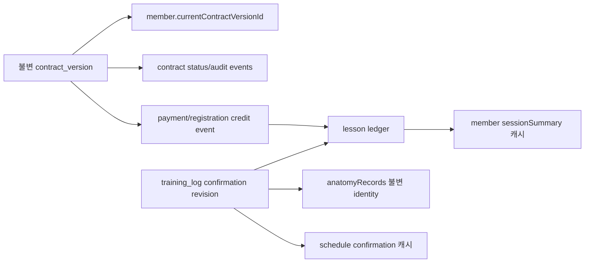

# 계약·회원·회차 데이터 Source of Truth 감사

## 2026-07-16 Personal 레슨일지 확정 source 추가

- 신규 personal 레슨일지 관계의 원본은 `training_logs/{lessonLogId}`이며 path ID와 필드 `lessonLogId`가 같고 `trainerId == Auth UID`, `workspaceType=personal`이다.
- log의 `memberId`는 같은 owner의 canonical personal member를 가리킨다. `scheduleDocId`는 선택이지만 존재하면 같은 owner/personal이며 schedule memberId와 log memberId가 같아야 한다.
- 확정 상태의 원본은 log의 `status`와 `confirmationRevision`; member `lessonStats`·회차 필드와 schedule 확정 필드는 같은 Function transaction에서 갱신되는 materialized cache다.
- 회차 증감 감사 원장은 `members/{memberId}/lesson_ledger/{lessonLogId}`와 `{lessonLogId}_reverse`다. 동일 log의 상태를 먼저 확인하여 finalize/cancel event를 각각 한 번만 만든다.
- `completed`와 `no_show_deducted`만 잔여회차를 감소시킨다. `no_show_not_deducted`와 `service`는 회차를 유지하고 상태별 통계만 갱신한다. 취소는 실제 `deductionApplied` 증거가 있을 때만 회차를 복구한다.
- 기존 legacy fallback 필드와 legacy confirm/cancel service는 관리자/Debug 경로에만 남긴다. 신규 personal 계산에 합치거나 owner를 backfill하지 않는다.

## 2026-07-16 Anonymous 회원 누적·등급 source 추가

- 신규 personal 회원 owner의 원본은 `members/{memberId}.trainerId == Auth UID`다.
- 누적 유효 회원 수의 materialized source는 `trainer_profiles/{uid}.lifetimeQualifiedMemberCount`이며 Function transaction만 변경한다.
- 전화번호 중복은 별도 claim 원장 없이 Function transaction의 `trainerId + workspaceType + phoneNormalized` scoped query로 판정한다. 전화번호는 문서 ID나 전역 claim path에 사용하지 않으며 다른 trainer workspace와 공유되는 유일값이 아니다.
- 달성 등급의 원본은 profile의 `earnedTier`/`earnedTierRank`이며, 표시용 `tier`도 같은 transaction에서 동기화한다. 후원, legacy 카카오 수, 계약 수는 이 계산에 포함하지 않는다.
- `managedMemberCount`는 현재 active/paused 관리 수이고 누적값과 별개다. dormant/expired/deleted 전환은 관리 수만 변경하고 누적·등급은 낮추지 않는다.
- legacy 문서는 이 원장에 자동 포함하거나 익명 UID로 귀속하지 않는다.

## 2026-07-15 Linked Beginner member count 추가

- 신규 personal member의 owner source는 `members/{memberId}.trainerId`이며 Auth UID와 같아야 한다.
- 관리 상태 source는 서버 관리 `managementState`; 포함 여부의 materialized 값은 `countsTowardLimit`이다.
- workspace 사용량 source는 `trainer_profiles/{uid}.managedMemberCount`이며 member 생성·상태 전환 transaction에서만 변경한다.
- legacy `memberStatus`와 `membershipStatus`는 신규 canonical count의 source로 섞지 않는다. legacy 자동 집계·귀속은 없다.

감사일: 2026-07-15

## 결론

현재는 단일 source of truth가 아니라 `members`, `contracts`, `membership_contracts/current`, `training_logs`, `training_logs/.../anatomyRecords`, `schedules`, `members/.../lesson_ledger`에 원본과 파생값이 중복 저장된다. 읽기 코드는 여러 과거 필드를 순서대로 fallback하고, 쓰기 코드는 일부 또는 전부를 함께 갱신한다. 이 구조는 부분 성공과 값 충돌을 숨긴다.

2026-07-15 tenant identity 추가 감사에서 앱 시작 Auth gate와 로그인/로그아웃/계정전환 흐름이 없고 `trainer_profile/me`가 계정과 무관한 고정 경로임을 확인했다. 따라서 현재 데이터의 canonical trainer owner는 확정되지 않았다. `FirebaseAuth.currentUser.uid`는 Auth 체계를 도입한 뒤의 목표 필드일 뿐, 현재 legacy/new write에 자동 주입할 수 있는 검증된 source of truth가 아니다. 조직 계정도 organization membership과 active branch 관계가 정의되기 전에는 organizationId를 tenant source로 간주하지 않는다.

권장 기준은 다음과 같다.

- 계약 내용: 불변 `contractVersion` 문서가 원본.
- 현재 계약: member의 검증된 `currentContractVersionId` 포인터는 파생/참조.
- 회차 증감: append-only lesson/credit ledger가 원본, member count는 transaction으로 갱신하는 캐시.
- 일정: `schedules/{id}`가 일정 원본, 확정/차감 증거는 training log와 ledger ID로 참조.
- 결제: 계약 snapshot과 별개로 결제 provider/수기 결제 event 원장을 두고 계약에는 참조와 서명 당시 snapshot만 보존.

## 현재 필드와 권장 단일 출처

| 개념 | 현재 읽기/쓰기 출처 | 충돌 시 현재 우선순위 | 위험 | 권장 source of truth |
|---|---|---|---|---|
| `totalSessions` | member top-level, `sessions.total`, `sessionTotal`, contract `sessionCount`, membership current | quick sign/confirm은 top-level → nested → legacy | 여러 write 경로가 서로 덮음 | registration/contract credit ledger 합계. member `sessionSummary.total`은 파생 캐시 |
| `remainingSessions/remainSessions` | `remainSessions`, `remainingSessions`, `sessions.remain`, `remainingPt`, `ptRemaining`, schedule 문자열 snapshot | 코드별 fallback 순서는 대체로 왼쪽 순 | 타입도 int/string 혼재, 오래된 값이 새 값을 가릴 수 있음 | ledger 합계. member canonical `sessionSummary.remaining` 하나와 revision/version |
| `doneSessions` | top-level, `sessions.done`, 없으면 total-remain 추정 | top-level 우선 | service/no-show 의미와 단순 차감이 혼재 | ledger event type별 집계 |
| `lessonRegistered` | member의 여러 flag/`lessonsNotRegistered`, schedule/member 연결 상태 | 화면별 상이 | 계약 존재와 실제 회차 등록 혼동 | 등록 credit event 존재 여부 + current membership status |
| `contractSigned` | member top-level, contract status/서명 | quick sign은 member bool 또는 `lessonSync.contractId` 존재만으로 계약 basis 결정 | 1단계 서명도 true, 무효/삭제 뒤 남음 | current immutable contract version의 `status=completed`를 서버가 검증해 파생 |
| `contractSignedAt` | member top-level, nested membership, contract basic/final timestamps | 화면별 상이 | client/server 시간이 섞임 | completed version의 `completedAtServer`; member는 캐시만 |
| current contract ID | member `contractId`, `lessonSync.contractId`, contract 자체 ID | 화면별 상이 | 여러 계약 중 최신/유효 선택 규칙 없음 | member `currentContractVersionId`를 서버 transaction으로 관리 |
| 회원권 계약 | `members/{id}/membership_contracts/current` + member 요약 필드 | current 한 문서 | 이전 계약 덮어쓰기, signed/draft 혼합 | `membership_contract_versions/{versionId}` + current pointer |
| membership start/end/status | member top-level/nested, membership current, 계약 입력 | 회원카드가 주로 member | 계약 변경/정지/재개와 snapshot 불일치 | membership lifecycle event + canonical membership aggregate |
| 결제 금액/방법/일자 | contract fields, member `paymentSummary`, membership 표시 인자 | 계약 자동등록 시 member summary 덮음 | 결제 성공과 계약 입력이 구분되지 않음 | payment ledger/provider receipt; 계약에는 signed snapshot |
| 재등록 횟수 | member `reregisterCount` 등 화면별 field | 확인된 중앙 계산 없음 | 계약 자동등록과 상담 요청이 별도 | registration event count 파생 |
| service/no-show counts | `sessions.*Count`, `lessonStats.*Count`, training log status | confirm/cancel이 둘 다 갱신 | transaction 밖 write나 오래된 경로로 drift 가능 | lesson ledger event type별 집계 |
| 레슨확정 | schedule flags/IDs, training log `locked/lessonConfirmed`, member ID arrays, ledger | 서비스가 transaction으로 함께 갱신 | 다른 수동 log 경로가 별도 구현 | training log immutable confirmation revision + ledger, schedule/member는 캐시 |
| 서명 요청 | `sign_requests/{token}`와 training log | request status + log signed flags | owner/revision 결속 없음 | 서버 request record + immutable signed revision/audit receipt |
| anatomy 레슨 관계 | path `training_logs/{lessonLogId}/anatomyRecords/{id}`와 child `lessonLogId`, 부모 `hasAnatomyRecords` | 서비스가 부모 존재와 path/field 일치를 transaction에서 검증 | 현재 Rules가 없어 클라이언트 검증만으로는 보안 경계가 아님 | 존재하는 parent training log ID가 관계 원본. child lessonLogId는 검증된 불변 복제 |
| anatomy owner/member | parent와 child의 `trainerId/memberId`, Firebase Auth UID | 서비스가 auth/context/parent/child 일치와 update 불변성을 검사 | owner/member 없는 legacy 부모는 저장 차단되며 migration 필요 | parent의 서버 검증된 owner/member가 원본; child는 불변 복제 |
| anatomy schedule | parent/child `scheduleDocId` | 선택 참조로 처리하고 양쪽에 값이 있을 때만 일치 검사 | schedule 없는 정상 로그와 부모 없는 수동 초안은 서로 다른 문제 | 선택 참조. 존재할 때만 parent와 동일, 레슨 관계 원본으로 사용하지 않음 |
| anatomy 개수 | parent `hasAnatomyRecords`, legacy 배열 길이, 실제 child 개수 | 목록은 legacy 배열 길이를 표시 | 신규 child 구조는 0개로 표시 가능 | 서버/transaction 관리 `anatomyRecordCount` 또는 child query |

## 쓰기 주체와 동기화

### 계약 완료와 회원카드

1. `_saveStep1Contract`가 계약과 회원을 transaction으로 저장한다.
2. 이때 기본 양측 서명만으로 member `contractSigned=true`가 된다.
3. `_saveStep2Contract`는 contract 완료를 단독 write한다.
4. 완료 후 `_offerClientCardAutoRegistrationIfNeeded`가 별도 비동기 흐름으로 회원 자동등록을 제안한다.
5. 사용자가 동의하면 `_registerClientCardFromContract`가 member와 contract의 autoRegister metadata를 transaction으로 갱신한다.

따라서 “최종 완료”와 “회원카드 회차 반영”은 하나의 원자적 전이가 아니다. 최종 계약은 완료됐지만 회원카드는 갱신되지 않을 수 있다. 반대로 1단계에서 이미 `contractSigned=true`일 수 있다.

### 재등록

자동등록 payload는 계약 총회차를 total/remain에 넣고 done/no-show/service를 0으로 초기화한다. 기존 회원과 merge하므로 재등록을 “기존 잔여 + 신규 구매”로 누적하지 않고 기존 집계를 덮을 수 있다. 권장 방식은 `contract_credit` ledger event를 추가하고 current summary를 transaction에서 다시 계산하는 것이다.

### 레슨 차감과 취소

- `LessonConfirmationService.confirmFromHome` 및 quick sign 저장은 member/log/schedule/ledger를 transaction으로 갱신하고 deduction ID로 중복 차감을 일부 방지한다.
- `LessonConfirmCancelService.cancelByScheduleDocId`는 같은 transaction에서 remain/done 복원, log void, schedule flags 제거, reverse ledger를 기록한다.
- 다만 원본 count가 여러 키에 복제되고 다른 레슨일지 경로에도 유사한 차감 코드가 있어 모든 진입점이 동일 invariant를 공유하지 않는다.
- contract basis 판단이 `contractSigned==true || lessonSync.contractId 존재`라 미완료/삭제 계약도 계약 기반으로 분류될 수 있다.

## 부분 성공 경계

| 흐름 | 원자적 범위 | 범위 밖 실패 결과 |
|---|---|---|
| 1단계 계약 | contract + member | counter 번호가 먼저 소비될 수 있음 |
| 최종 계약 | contract 한 문서 | 회원 자동등록/회차 반영 누락 가능 |
| 회원 자동등록 | member + contract metadata | 호출 전 계약 완료와는 분리 |
| 회원권 초안 | 없음, 두 순차 write | current와 member status 불일치 |
| 회원권 서명 | 없음, Storage + 두 write | 고아 이미지/반쪽 signed 상태 |
| 회원권 이미지 보관 | 없음, Storage + 두 write | 고아 이미지/URL 요약 불일치 |
| 원격 서명 | request + training log transaction | re-registration request는 별도, member history read는 별도 |
| 레슨확정/취소 | member + log + schedule + ledger transaction | sign request cancel은 별도 호출일 수 있음 |
| anatomy 저장/삭제 | 검증된 parent read + child create/update/delete + parent metadata transaction | 부모를 생성하지 않고 identity/존재를 검사하나 현재 Rules에서는 권한 거부 |

## Anatomy 진입 경로와 `scheduleDocId`

| 진입/기록 유형 | lessonLogId | scheduleDocId | 현재 결과 | 감사 결론 |
|---|---|---|---|---|
| 회원카드·회원목록의 새 수동 레슨일지 | 로컬 microseconds ID | 없음 | 화면 진입 후 service가 `parent_not_found`로 저장 차단 | schedule 필수 때문이 아니라 정식 parent 생성 흐름 부재가 본질 |
| 홈 일정에서 “레슨일지” 열고 새 수동 기록 | 페이지에는 회원 정보만 전달 | 페이지에 전달되지 않음 | 부모가 없으면 동일하게 저장 차단 | 호출 원점에 schedule이 있어도 현재 페이지에서 유실됨 |
| 홈 빠른서명 | `quick_sign_{scheduleId}` 또는 member/time fallback | 생성자상 선택, 홈 정상 일정이면 보통 있음 | 부모 identity가 유효하면 schedule 없이도 anatomy 허용 | quick sign 모델 자체는 schedule 없는 로그를 허용 |
| 레슨일지 페이지 원격서명 | 고유 quick_sign ID | request에 schedule 없음 | parent trainer/member가 있으면 anatomy 가능, 없으면 legacy 오류 | schedule 부재만으로 차단하지 않되 legacy identity 보강 필요 |
| 과거 training log | 문서 ID 있음 | 필드가 없을 수 있음 | parent identity가 유효하면 schedule 없이 허용 | owner/member 없는 문서는 migration 전 저장 차단 |
| 기존 anatomy parent | 문서 ID 있음 | 초기 구현 저장 시 필수 | 다시 열 수 있음 | 신규 정책에서 값은 보존하되 전체 모델 필수로 확대하지 않음 |

### 부모 존재와 identity

- `AnatomyLogService`는 parent 부재를 `parent_not_found`로 구분하고 더 이상 최소 parent를 생성하지 않는다.
- auth UID, context, parent, child의 trainer/member/path와 선택 schedule 관계를 검증하며 owner/member 없는 parent는 `legacy_parent_missing_identity`로 차단한다.
- 저장소에는 수동 초안을 정식 parent로 만드는 공통 service/repository가 명확하지 않아 새 생성 구조를 추측해 추가하지 않았다.
- 후속 흐름은 일반 레슨일지 service가 parent를 먼저 생성하고 안정 ID, owner, member를 확정한 다음 anatomy child save를 호출해야 한다.

### 업데이트와 삭제

- 모델의 `copyWith`는 화면 편집을 위해 identity 인자를 유지하지만 service가 기존 문서와 비교해 `anatomyLogId/lessonLogId/trainerId/memberId/createdAt` 변경을 차단한다.
- UI는 저장 직전 identity를 화면 값으로 덮어쓰지 않으며 service update payload도 허용된 기록 내용만 포함한다.
- 삭제는 transaction에서 parent와 child의 trainer/member/path를 확인하고 존재하는 선택 문서만 삭제한다.
- parent hard delete 시 child는 자동 삭제되지 않는다. parent 존재를 Rules에서 요구해 고아 접근을 먼저 막고, 승인된 retention cleanup을 별도로 운영해야 한다.

## 권장 모델

원칙:

1. 원장은 append-only event/revision이고 member/schedule summary는 재생성 가능한 캐시다.
2. 모든 event에는 `tenantId`, `ownerId`, `memberId`, `contractVersionId`, `idempotencyKey`, `createdAtServer`를 둔다.
3. 회차 차감/복구는 동일 서비스와 ledger invariant를 사용한다.
4. legacy fallback은 읽기 telemetry로 사용량을 계측한 뒤 명시적 migration을 거쳐 제거한다.
5. 계약 취소는 회차를 암묵 롤백하지 않는다. 사용된 회차와 환불 정책을 별도 adjustment event로 기록한다.

## 우선 조치

- P0: `contractSigned`를 최종 immutable completed revision의 파생값으로 재정의.
- P0: owner/tenant와 current contract 선택 규칙 확정.
- P0: 앱 시작 Auth gate, 로그인·로그아웃·계정전환과 UID 기반 trainer profile 결속 확정.
- P0: 개인 trainer와 organization/branch membership·active tenant 모델 확정.
- P1: 재등록을 overwrite가 아닌 credit ledger로 전환.
- P1: 회원권 current 문서를 version+pointer로 전환.
- P1: 모든 차감 진입점을 공통 transaction/idempotency service로 통합.
- P2: legacy remaining/session 필드 fallback 제거 계획 수립.
- P0: anatomy parent/child owner·member·path 불변 조건을 Firestore Rules와 emulator 행렬로 강제·검증.
- P1: 수동 anatomy 진입 전에 검증된 training log 부모를 만드는 공통 생성 흐름 정의.
- P1: owner/member 없는 legacy training log의 승인된 migration 정책 수립.
- P1: parent 삭제/retention과 orphan child 차단·정리 정책 수립.
